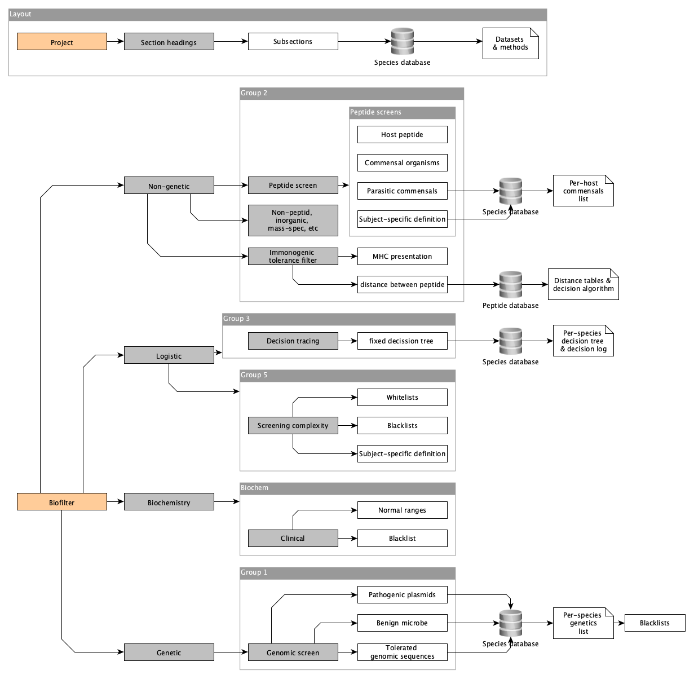

# About
Genomic and biochemical potential in transporter biofilter technology.

LaTeX source code for a manuscript under development. 

## What is this
This is a manuscript about the potential and technical requirements for biolfilter technology. 
While implementation is currently a subject for science-fiction, the methodology can be feasibly produced today.

In the science fiction world of Star Trek, Biofilters are included on all transporters to decontaminate transported objects.
Biofilters remove pathogens and radiation to prevent contamination and unexpected incidents.

Much of the major requirements for this techonology has already been solved but is spread over the vast fields of bioinformatics, genomics, microbiology, etc. 
Methods can often have rather cryptic names and may not be searchable by non-experts when they may need it (our future physicist colleagues).
This project is pulling together the current best-practices in these topics that can be applied for the method of Biofiltration.
The content must strictly adhere to reputable scientific literature sources, and methods must be in common usage within the bioinformatic community (or other related communities).

## Outline
This outline graph is likely to grow as a map of the layout for quick understanding.
This layout may also become a figure within the manuscript. 
The order hierarchy should be easy to follow, but main sections are modular. Hyperlink referencing back and forth will likely be required to keep repetition and word count down.

## Why is this open-source
This manuscript will not produce new software or primary methods, but will instead knit together some current best practices to offer new potential.
Therefore it is unlikely to be "scooped".
If for some reasome someone wanted to publish any of the content it is likely that any plagerism from this public repository would be obvious.
Scientific research should be boarderless and open, therefore contributions are welcome from anyone.

## Stages
- This manuscript launches the first step; an outline of the potential and limitations of current bioinformatics. 
- The second step will be a compillation software from the current best practices in each required component. 
- The third would be developing new methods that are not avaialble currently.
- The fourth would be implementation in some near future when transporter technology science has caught up with science-fiction.

## Welcome
Once this manuscript reaches a rhobust level it will be published to a pre-print server and ultimately submitted to a reputable journal for peer review. 
If you would like to contribute as an author, please feel free to either submit a pull request with your changes or email me with you edits if you are not used to LaTeX documents.
I will be happy to share it in a different format like MS Word.
Authorship will be offered for meaningful contributions.

"_As man reaches into space, he will acquire new drugs, food, minerals,\
and knowledge which he cannot conceive of now._"\
— Gene Roddenberry
